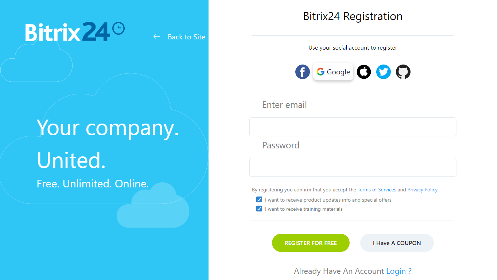
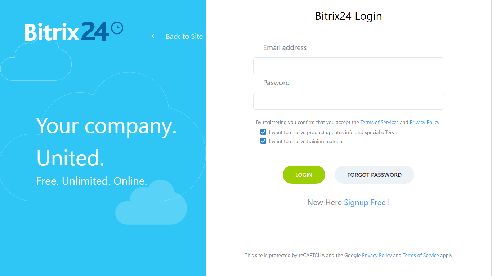
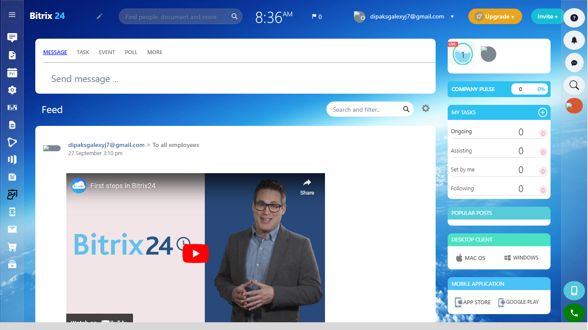

# possible-temper-2642

This is a clone of Bitrix24 website. From Homepage, Login&amp;SignUp to Feeds-Update, Tasks Adding-Deleting-Changing Status, Calendar  Todos-Adding-Deleting. We have cloned every functionalities. Checkout deployed link 👇🏻

🔗 https://bitrix24in.netlify.app/ 🌐

Features
- Login / Signup 
- Google authentication 
- Feeds ( Send feeds to all employees)
- Task ( You can add tasks )
- Calendar (You can add task with calender )

# Some glimpse from our Website

<h1>Home Page</h1>

<h1>Signup Page</h1>

<h1>Login Page</h1>

<h1>Feeds Page</h1>

<h1>Task Page</h1>

<h1>Calender Page</h1>

# [Getting Started]

<h3>Execution</h3>

If you want to run our project in your local machine

Follow the given steps:

<ul>
<li>Clone our repository <a href="https://github.com/amitchouhan948/possible-temper-2642.git">https://github.com/amitchouhan948/possible-temper-2642.git</a></li>
<li>Open our code in VS code</li>
<li>Go to the client folder using cd client command</li>
<li>In the terminal write npm install, it will install all the dependencies for our project</li>
<li>Than simply write npm start</li>
<li>Congratulations! Now you can navigate to our website</li>
</ul>

<h1>Tech Stack</h1>
<ul>
<li>React.JS</li>
<li>Chakara UI</li>
<li>MongoDB</li>
<li>Express</li>
<li>Google Firebase</li>
</ul>

# Creators

<ul>

  <li><a href="https://github.com/amitchouhan948">@amit chouhan</a></li>
  <li><a href="https://github.com/itsDipaks">@Dipak pawar</a></li>
  <li><a href="https://github.com/Abhishek07788">@Abhishek Solenki</a></li>
  <li><a href="https://github.com/atrivedi8988">@Aman trivedi</a></li>
  <li><a href="https://github.com/sumit-skribe">@Sumit Kumar</a></li>
</ul>

